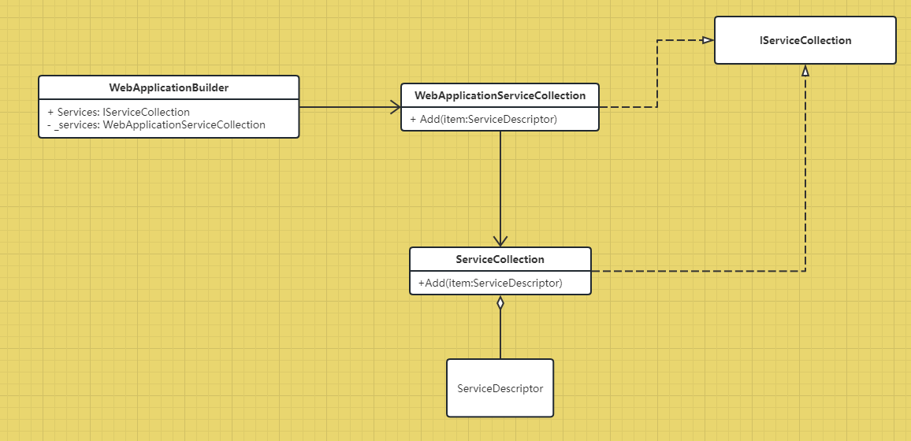

# DotNetCore6
descript framework's functions with 'ASP DOTNET CORE 6' the book' s explain


## IOC源码
本文记录自己阅读NET Core依赖注入框架源码
记录中阅读过以下这些文章
* [老版本net core](https://www.cnblogs.com/bill-shooting/p/5540665.html)
* [有点思考](https://www.cnblogs.com/wucy/p/13268296.html)
* [比较乱](https://www.cnblogs.com/Z7TS/p/17402544.html)

因为他们有的一上来都是直接说设计到什么类型，然后才开始介绍，属于知识前置了，所以对于我来说，入门看的时候很难受。而且也是还没开始就一堆专业术语堆砌，所以本文记录下自己的阅读。

1. 环境介绍
   - `dotnet new console --name IOCAbstract`
        新建控制台项目,之所以使用控制台而不是NET Core本身的环境，是因为NET Core利用这个依赖注入框架帮我们做了很多东西，我们要看源码就先从简单的入手，且依赖注入框架也是做成了Nuget包，所以我们也可以在控制台直接使用
   - `dotnet add package Microsoft.Extensions.DependencyInjection`
        添加DI的Nuget包,NET Core的项目不用是因为它已经帮我们引用了且放在全局引用上，所以我们都不用自己去添加Nuget包
   - `using Microsoft.Extensions.DependencyInjection;`
   - `using Microsoft.Extensions.DependencyInjection.Extensions;` 
        注意，这里要在控制台上方引入此两个命名空间
   - 这里使用NET 6.0+ 或者 7.0+均可以，老旧的什么startup.cs文件就一律不看了，看了很多文章都还是写了这个，想吐槽下什么习惯什么的，想入门学习下非得让我去看你们之前老旧的项目是如何实现这个一样的结构的，完全没有必要。
   - 作为原始对比，上面的控制台没有使用框架，那我们就还要再建一个框架，看看它具体做了什么
   - `dotnet new mvc --name MVC`  
        因为是NET Core框架，所以上面引用的Nuget包就不用加了，直接就可以开始看和写了。
2. 源码

    - __代码对比：NET Core__  
        首先我们先来看在NET Core中，我们使用的方法是，`buidler.Services.Add<Interface, Implyment>();` 这里的 `Services`类型就是`IServiceCollection`，从导航的类看，知道是`WebApplicationBuilder`的公开属性，代码如下
        ```
        public IServiceCollection Services { get; }
        ```
        字面意思就是一个Service的集合类，那我第一想法就是他里面有一个list，list里面的类型是Service，然后Add这些方法的名字，应该就是往这个list里面新建Service，这些描述只是我对于这个类型的想法，然后我们继续看代码是不是这样实现的。返回到`Program.cs`文件中，
        `var builder = WebApplication.CreateBuilder(args);`程序一开始便使用了这个方法，F12导航进去之后，看到实现是：
        ```
        public static WebApplicationBuilder CreateBuilder(string[] args) =>
            new(new() { Args = args });
        ```
        ()里面的`new() {...}` 是类型`WebApplicationOptions`的实例化，外层的`new(...);`则是类型`WebApplicationBuilder`的实例化，也就是将`WebApplicationOptions`的实例作为`WebApplicationBuilder`实例的构造参数。因为options我们并没有传递什么参数，所以我们先看`Services`相关的是怎么来的，所以我们直接看`WebApplicationBuilder`里面的以`WebApplicationOptions`的实例作为参数的构造函数。直接F12导航进去查看，发现如下代码
        ```
        private readonly WebApplicationServiceCollection _services = new();
        internal WebApplicationBuilder(WebApplicationOptions options, Action<IHostBuilder>? configureDefaults = null)
        {
            Services = _services;
            ...
        }
        ```
        因为我们只要看`Services`，所以其余代码我省略了，也就是说，`Services`这个属性，在`var builder = WebApplication.CreateBuilder(args);`开头这一句里面就已经初始化了，接下来我们自然要看看这个初始化的值`_services`的类型`WebApplicationServiceCollection`,F12导航进去之后，显示如下代码
        ```
        internal sealed class WebApplicationServiceCollection : IServiceCollection
        {
            ...
        }
        ```
        所以也就是说，NET Core里面的`Services`就是一个`IServiceCollection`实现类的实例。我先不用看其他的方法，我先知道它的实现类型是什么就可以了。
        然后再继续看，我们通常添加接口和接口的对应实现类的方法如下：
        ```
        builder.Services.AddSingleton<Interface, Implyment>();
        ```
        比如我们实现一个`IMidderware`接口的类`Define`,代码如下：
        
        ```
        public class Define : IMiddleware
        {
            public Task InvokeAsync(HttpContext context, RequestDelegate next)
            {
                throw new NotImplementedException();
            }
        }
        ```
        然后在`Program.cs`文件中,在上面的`WebApplication.CreateBuilder(args);`下方写入该行代码`builder.Services.AddSingleton<IMiddleware, Define>();`；官方说法是注入一个单例的接口和对应的实现类型，那我不管它字面如何表达，直接F12导航看下`AddSingleton<>`这个方法的实现，代码如下：
        ```
        public static IServiceCollection AddSingleton<TService, [DynamicallyAccessedMembers(DynamicallyAccessedMemberTypes.PublicConstructors)] TImplementation>(this IServiceCollection services)
            where TService : class
            where TImplementation : class, TService
        {
            if (services == null)
            {
                throw new ArgumentNullException(nameof(services));
            }

            return services.AddSingleton(typeof(TService), typeof(TImplementation));
        }
        ```
        忽略参数的特性，因为我们没有使用到反射，是框架在用，所以直接看参数类型和名称就可以了。
        也就是这个是`IServiceCollection`类型的扩展类，`if()...`是在检测`services`是不是为空，因为上面`Services`已经初始化了，所以直接到`AddSingleton(typeof(TService), typeof(TImplementation)`方法。F12导航如下代码：
        ```
        public static IServiceCollection AddSingleton(
            this IServiceCollection services,
            Type serviceType,
            [DynamicallyAccessedMembers(DynamicallyAccessedMemberTypes.PublicConstructors)] Type implementationType)
        {
            if (services == null)
            {
                throw new ArgumentNullException(nameof(services));
            }

            if (serviceType == null)
            {
                throw new ArgumentNullException(nameof(serviceType));
            }

            if (implementationType == null)
            {
                throw new ArgumentNullException(nameof(implementationType));
            }

            return Add(services, serviceType, implementationType, ServiceLifetime.Singleton);
        }
        ```
        可以看到这里也是扩展类，中间三个`if()...`都是在判断，然后直接到`Add(services, serviceType, implementationType, ServiceLifetime.Singleton);`的方法，F12导航如下代码：
        ```
        private static IServiceCollection Add(
            IServiceCollection collection,
            Type serviceType,
            [DynamicallyAccessedMembers(DynamicallyAccessedMemberTypes.PublicConstructors)] Type implementationType,
            ServiceLifetime lifetime)
        {
            var descriptor = new ServiceDescriptor(serviceType, implementationType, lifetime);
            collection.Add(descriptor);
            return collection;
        }
        ```
        可以看到也是扩展类，可以看到，这里终于返回了...F12按了几次，所以封装深，容易蒙，第一直觉就是画UML图(# todo)，然后继续看下这个方法，发现封装深了之后，方法都直接默认校验好了，也就是调用它的方法应该把校验都做完，然后留一个核心设计方法，目前的感受是这样。第一句是新建一个`ServiceDescriptor`类型实例，然后把这个实例调用`IServiceCollection`接口类的`Add`方法，那我们先看这个`Add`,因为在上面我们知道`Services`类型是`WebApplicationServiceCollection`，所以直接看`WebApplicationServiceCollection`的`Add`实现，代码如下：
        ```
        private IServiceCollection _services = new ServiceCollection();
        
        ...

        public void Add(ServiceDescriptor item)
        {
            CheckServicesAccess();

            if (TrackHostedServices && item.ServiceType == typeof(IHostedService))
            {
                HostedServices.Add(item);
            }
            else
            {
                _services.Add(item);
            }
        }
        ```
        也就是说，`Add`方法是调用`_services.Add(item);`的方法，而在`WebApplicationServiceCollection`这个类一开始，`_services`就初始化为`ServiceCollection()；`所以直接看这个方法是如何实现`Add`的。F12导航进去如下代码为：
        ```
        private readonly List<ServiceDescriptor> _descriptors = new List<ServiceDescriptor>();
        
        ...

        void ICollection<ServiceDescriptor>.Add(ServiceDescriptor item)
        {
            _descriptors.Add(item);
        }
        ```
        终于看到`List<>`了，也就是`Add`最终是声明了一个`List<ServiceDescriptor>`列表，然后将我们注册的接口和实现类，包装成`ServiceDescriptor`类型实例并添加到该列表中。
        也就是虽然类型不一样，但思路跟我一开始看到方法名称的时候是一样的。
        所以`builder.Services.AddSingleton<IMiddleware, Define>();`就知道是怎么来的了，然后先不画UML，先看另外两种用到的注册方法：
        ```
        builder.Services.AddScoped<IMiddleware, Define>();
        builder.Services.AddTransient<IMiddleware, Define>();
        ```
        同样的F12导航`AddScoped<IMiddleware, Define>()`，代码如下：
        ```
        public static IServiceCollection AddScoped<TService, [DynamicallyAccessedMembers(DynamicallyAccessedMemberTypes.PublicConstructors)] TImplementation>(this IServiceCollection services)
            where TService : class
            where TImplementation : class, TService
        {
            if (services == null)
            {
                throw new ArgumentNullException(nameof(services));
            }

            return services.AddScoped(typeof(TService), typeof(TImplementation));
        }
        ```
        也是一样是扩展方法，特性同样不用看，一开始也是检测是否为空，然后调用`AddScoped(...)`方法，F12进去该方法查看代码如下：
        ```
        public static IServiceCollection AddScoped(
            this IServiceCollection services,
            Type serviceType,
            [DynamicallyAccessedMembers(DynamicallyAccessedMemberTypes.PublicConstructors)] Type implementationType)
        {
            if (services == null)
            {
                throw new ArgumentNullException(nameof(services));
            }

            if (serviceType == null)
            {
                throw new ArgumentNullException(nameof(serviceType));
            }

            if (implementationType == null)
            {
                throw new ArgumentNullException(nameof(implementationType));
            }

            return Add(services, serviceType, implementationType, ServiceLifetime.Scoped);
        }
        ```
        可以上下文对比下，跟`builder.Services.AddSingleton<IMiddleware, Define>();`方法一样，但是在调用`Add(...)`方法的时候只有最后一个参数是`ServiceLifetime.Scoped`,同理
        `builder.Services.AddTransient<IMiddleware, Define>();`方法也是执行到该方法，只不过最后一个参数是`ServiceLifetime.Transient`,所以至此就都知道了，注册接口和实现类型是怎么一回事了。
    - __代码对比：Console__  
        看完了NET Core的接口和实现类型怎么注册的，现在来看控制台能否使用跟它一样的功能。
        因为我们加了Nuget包，也引用了两个命名空间，所以直接如何使用，代码如下：
        ```
        // See https://aka.ms/new-console-template for more information
        using IOCAbstract;
        using Microsoft.Extensions.DependencyInjection;
        using Microsoft.Extensions.DependencyInjection.Extensions;

        Console.WriteLine("Hello, World!");


        IServiceCollection _services = new ServiceCollection();
        _services.AddSingleton<IMiddleware, Define>();
        ```
        在`Console.WriteLine("Hello, World!");`的下方两句代码，是如何使用这个框架的关键，可以看到，因为在`Console.WriteLine("Hello, World!");`及它之前的代码，并没有跟NET Core一样，有一个`builder`的存在，所以这里也就没有`builder.Services`可以直接使用，那在NET Core中我们知道，`Services`的类型是`IServiceCollection`的实现类，在NET Core的F12导航过程中我们可以看到，实现了这个接口的类有两个，一个是`WebApplicationServiceCollection`, 另一个是`ServiceCollection`,而具体的`Add`操作又只是在`ServiceCollection`这个类中，所以第一想法是我们先直接实现核心，也就是`new ServiceCollection();`，这里也就是在控制台程序中创建了一个跟NET Core的`builder.Services`一样的实例，所以剩下的，我们就再去调用扩展方法即可，也就是第二句`_services.AddSingleton<IMiddleware, Define>();`可以F12导航进去之后，就发现跟NET Core框架是一样的流程了，所以到此他们两个的各自实现就清楚了。接下来开始画UML总结
3. 总结  
   
   

## Configuration源码
继续记录下一个组件Configuration，同样的也是参考了如下文章：
* [还是很乱](https://www.cnblogs.com/Z7TS/p/17426023.html)
* [应该是NET5.0之前的老版本](https://www.cnblogs.com/wucy/p/13172284.html)

1. 环境介绍  
   同样的，因为Configuration在NET Core框架已经集成，所以我们也是建立一个控制台程序和一个NET Core程序来做源码对比，这里的NET Core仍然复用解读IOC源码的MVC项目。
   - `dotnet new console --name ConfigAbstract`
        新建控制台项目.
   - `dotnet add package Microsoft.Extensions.DependencyInjection`        
   - `dotnet add package Microsoft.Extensions.Configuration`
     添加Config和DI的Nuget包,NET Core的项目不用是因为它已经帮我们引用了且放在全局引用上，所以我们都不用自己去添加Nuget包
   - `using Microsoft.Extensions.DependencyInjection;`
   - `using Microsoft.Extensions.DependencyInjection.Extensions;` 
   - `using Microsoft.Extensions.Configuration;`
        注意，这里要在控制台上方引入上述命名空间
2. 源码
   - __代码对比：NET Core__  
        首先我们还是先看NET Core里面的框架是怎么用的，我们的使用方法是`builder.Configuration.SetBasePath(Directory.GetCurrentDirectory()).AddJsonFile("people.json");`，其中`SetBasePath(Directory.GetCurrentDirectory())`是设置读取文件的时候，基本路径是当前的项目文件夹，`AddJsonFile("people.json");`这个则是读取的是`people.json`文件。那我们看下`Configuration`是什么，发现它也是`WebApplicationBuilder`的公开属性，代码如下：
        ```
        public ConfigurationManager Configuration => _hostApplicationBuilder.Configuration;
        ```
        那这里的`_hostApplicationBuilder`F12导航看下代码如下：
        ```
        private readonly HostApplicationBuilder _hostApplicationBuilder;
        ```
        也就是一个静态只读的变量，这个变量是在`WebApplicationBuilder`的类实例初始化的时候实例化的，可以在`WebApplicationBuilder`的构造函数里面看到如下代码：
        ```
        internal WebApplicationBuilder(WebApplicationOptions options, Action<IHostBuilder>? configureDefaults = null)
        {
            var configuration = new ConfigurationManager();

            configuration.AddEnvironmentVariables(prefix: "ASPNETCORE_");

            _hostApplicationBuilder = new HostApplicationBuilder(new HostApplicationBuilderSettings
            {
                Args = options.Args,
                ApplicationName = options.ApplicationName,
                EnvironmentName = options.EnvironmentName,
                ContentRootPath = options.ContentRootPath,
                Configuration = configuration,
            });
            
            ...
        }
        ```
        其他的构造我们先不看，可以看到`_hostApplicationBuilder`是实例化了。而且访问`_hostApplicationBuilder.Configuration`可以发现，就是访问实例化中`HostApplicationBuilderSettings`的`Configuration`属性，而这个属性又是`ConfigurationManager`的实例化对象，所以这个我们知道了`builder.Configuration`就是一个`ConfigurationManager`的实例化对象。然后我们直接看`AddJsonFile("people.json");`是怎么实现的。F12导航进去可以发现如下代码：
        ```
        public static IConfigurationBuilder AddJsonFile(this IConfigurationBuilder builder, string path, bool optional)
        {
            return AddJsonFile(builder, provider: null, path: path, optional: optional, reloadOnChange: false);
        }
        ```
        继续导航`AddJsonFile(builder, provider: null, path: path, optional: optional, reloadOnChange: false);`代码：
        ```
        public static IConfigurationBuilder AddJsonFile(this IConfigurationBuilder builder, IFileProvider? provider, string path, bool optional, bool reloadOnChange)
        {
            ThrowHelper.ThrowIfNull(builder);

            if (string.IsNullOrEmpty(path))
            {
                throw new ArgumentException(SR.Error_InvalidFilePath, nameof(path));
            }

            return builder.AddJsonFile(s =>
            {
                s.FileProvider = provider;
                s.Path = path;
                s.Optional = optional;
                s.ReloadOnChange = reloadOnChange;
                s.ResolveFileProvider();
            });
        }
        ```
        可以看到，这两个都是`IConfigurationBuilder`的扩展方法，那我们的`builder.Configuration`是`ConfigurationManager`类，所以应该是有继承`IConfigurationBuilder`接口，导航到`ConfigurationManager`类定义发现确实继承了该接口，所以我们可以使用到这两个扩展方法，那继续看这扩展方法还调用了什么,导航代码如下：
        ```
        public static IConfigurationBuilder AddJsonFile(this IConfigurationBuilder builder, Action<JsonConfigurationSource>? configureSource)
            => builder.Add(configureSource);
        ```
        还是个扩展方法，将委托作为参数调用`Add()`方法，继续导航看`Add()`做了什么，代码如下：
        ```
        public static IConfigurationBuilder Add<TSource>(this IConfigurationBuilder builder, Action<TSource>? configureSource) where TSource : IConfigurationSource, new()
        {
            var source = new TSource();
            configureSource?.Invoke(source);
            return builder.Add(source);
        }
        ```
        可以看到，这也是扩展方法，这里是将委托的参数实例化，并将此实例化对象作为参数传递给该委托方法，所以也就是实例化了一个`JsonConfigurationSource`的类型对象，并将其属性赋值为如下：
        ```
        s =>
            {
                s.FileProvider = provider;
                s.Path = path;
                s.Optional = optional;
                s.ReloadOnChange = reloadOnChange;
                s.ResolveFileProvider();
            }
        ```
        最后看下`Add(source)`做了什么，继续导航，发现这个`Add`是代码：
        ```
        IConfigurationBuilder Add(IConfigurationSource source);
        ```
        也就是它是接口的方法，那我们就要回到`builder.Configuration`的定义`ConfigurationManager`类，看它是怎么实现这个接口`Add`方法的，代码如下：
        ```
        IConfigurationBuilder IConfigurationBuilder.Add(IConfigurationSource source)
        {
            ThrowHelper.ThrowIfNull(source);

            _sources.Add(source);
            return this;
        }
        ```
        可以发现，在`ConfigurationManager`类中，调用了`_sources.Add(source);`之后便return了，也就是追踪终于结束了。我们看下`_sources.Add(source);`做了什么，发现如下：
        ```
        public IList<IConfigurationSource> Sources => _sources;
        ```
        也就是只是把这个source添加到一个LIST集合里面去。所以至此我们就知道`AddJsonFile`是怎么做的了，接下来便开始画UML。
        
1. 总结